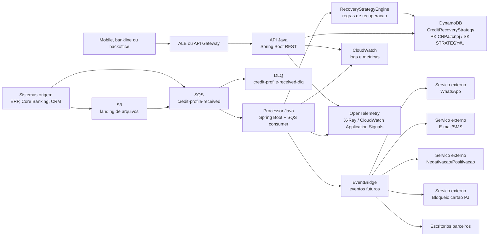
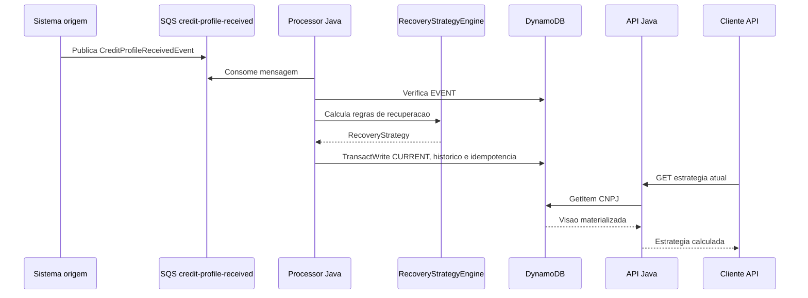

# Credit Recovery Platform

Projeto Java/Spring Boot para um case tecnico Back-End Cloud AWS: uma plataforma de recuperacao de credito para clientes PJ, orientada a eventos, resiliente, observavel e preparada para rodar em AWS.

## 1. Contexto do case

O sistema recebe perfis financeiros, historico de credito e dados cadastrais de clientes PJ para calcular estrategias personalizadas de recuperacao de credito.

Estrategias contempladas:

- Negativacao.
- Positivacao.
- Comunicacao por WhatsApp, e-mail ou SMS.
- Distribuicao para escritorios parceiros de cobranca.
- Bloqueio temporario de cartao PJ.
- Exibicao de mensagens em canais digitais, como mobile e bankline.

## 2. Decisao arquitetural

A solucao separa processamento assincrono e consulta sincrona. O processamento pesado e feito por consumidores SQS, enquanto a API REST apenas consulta uma visao materializada no DynamoDB. Isso reduz a latencia e ajuda a cumprir o requisito de resposta em ate 300 ms.

Na pratica:

- `credit-strategy-processor` consome eventos do SQS, executa regras de negocio, gera a estrategia, aplica idempotencia e grava a visao materializada no DynamoDB.
- `credit-strategy-api` responde consultas REST por chave primaria no DynamoDB, sem `scan`.
- `credit-recovery-domain` concentra records, enums, eventos, value objects e contratos compartilhados.

## 3. Estrutura

```text
credit-recovery-platform
|-- credit-recovery-domain
|-- credit-strategy-api
|-- credit-strategy-processor
|-- infrastructure
|   |-- localstack
|   |-- observability
|   |   `-- logstash
|   `-- terraform
`-- README.md
```

O projeto usa Java 21, Spring Boot 3.x e Lombok. O dominio usa `record` para modelos imutaveis e eventos, alem de uma interface selada para eventos de dominio. Nos servicos, Lombok reduz boilerplate de injecao de dependencias e logging sem esconder regras de negocio.

Arquitetura hexagonal aplicada:

- `credit-strategy-api`: adapters de entrada REST em `adapter.in.web`, adapter de saida DynamoDB em `adapter.out.dynamodb`, casos de uso em `application.service` e portas em `application.port`.
- `credit-strategy-processor`: adapter de entrada SQS em `adapter.in.sqs`, adapters de saida DynamoDB/eventos em `adapter.out`, orquestracao em `application.service` e contratos em `application.port`.
- `credit-recovery-domain`: dominio compartilhado sem dependencia de Spring, AWS SDK ou infraestrutura.

## 4. Arquitetura AWS



## 5. Fluxo de processamento assincrono



## 6. Fluxo de consulta REST

Endpoint principal:

```http
GET /api/v1/customers/{cnpj}/recovery-strategy
```

A API valida o CNPJ, normaliza o documento e executa um `GetItem` no DynamoDB:

- `PK = CNPJ#{cnpj}`
- `SK = STRATEGY#CURRENT`

Historico:

```http
GET /api/v1/customers/{cnpj}/recovery-strategies/history
```

O historico usa `Query` por `PK` e prefixo `SK begins_with STRATEGY#`. Nao ha `scan`.

## 7. Como rodar localmente

Pre-requisitos:

- Java 21.
- Maven 3.9+.
- Docker e Docker Compose.
- AWS CLI para executar os scripts LocalStack.

Subir LocalStack:

```bash
cd infrastructure/localstack
docker compose up -d
bash init-aws.sh
```

Rodar os testes:

```bash
mvn test
```

Subir tudo com Docker Compose:

```bash
docker compose -f infrastructure/localstack/docker-compose.yml up -d --build
```

Servicos expostos via Docker Compose:

- API: `http://localhost:8080`
- Processor actuator: `http://localhost:8082`
- LocalStack: `http://localhost:4566`
- Elasticsearch local: `http://localhost:9200`
- Logstash monitoring API: `http://localhost:9600`
- Logstash TCP JSON input: `localhost:5000`

Parar a stack:

```bash
docker compose -f infrastructure/localstack/docker-compose.yml down
```

Rodar o processor:

```bash
mvn -pl credit-strategy-processor -am spring-boot:run
```

Rodar a API em outro terminal:

```bash
mvn -pl credit-strategy-api -am spring-boot:run
```

Portas locais:

- API: `http://localhost:8080`
- Processor actuator: `http://localhost:8081` ao rodar via Maven, ou `http://localhost:8082` via Docker Compose.
- LocalStack: `http://localhost:4566`
- Elasticsearch local: `http://localhost:9200`
- Logstash: TCP `localhost:5000` e monitoring API `http://localhost:9600`
- Swagger UI: `http://localhost:8080/swagger-ui.html`

## 8. Como criar recursos no LocalStack

Os scripts estao em `infrastructure/localstack`:

```bash
cd infrastructure/localstack
bash create-sqs-queues.sh
bash create-dynamodb-table.sh
```

Recursos criados:

- Tabela DynamoDB `CreditRecoveryStrategy`.
- Fila principal `credit-profile-received`.
- DLQ `credit-profile-received-dlq`.

O endpoint padrao e `http://localhost:4566`. Para sobrescrever:

```bash
AWS_ENDPOINT=http://localhost:4566 AWS_REGION=us-east-1 bash init-aws.sh
```

## 9. Como publicar mensagem de teste

Com LocalStack ativo:

```bash
cd infrastructure/localstack
bash seed-message.sh
```

Exemplo de mensagem SQS:

```json
{
  "eventId": "evt-credit-profile-001",
  "correlationId": "corr-local-001",
  "occurredAt": "2026-06-20T10:00:00Z",
  "profile": {
    "document": {
      "value": "11222333000181"
    },
    "daysOverdue": 87,
    "debtAmount": 125000.5,
    "products": [
      {
        "type": "CREDIT_CARD_PJ",
        "active": true,
        "outstandingAmount": 85000.0
      }
    ],
    "internalScore": 812,
    "paymentHistory": {
      "paidInstallments": 12,
      "delayedInstallments": 3,
      "debtRegularized": false
    },
    "preferredChannel": "WHATSAPP",
    "whatsappConsent": true,
    "riskLevel": "HIGH",
    "activePjCard": true
  }
}
```

## 10. Como consultar estrategia via API

Depois que o processor consumir a mensagem:

```bash
curl -i \
  -H "X-Correlation-Id: corr-local-query-001" \
  http://localhost:8080/api/v1/customers/11222333000181/recovery-strategy
```

Historico:

```bash
curl -i \
  http://localhost:8080/api/v1/customers/11222333000181/recovery-strategies/history
```

Health e metricas:

```bash
curl http://localhost:8080/actuator/health
curl http://localhost:8080/actuator/metrics
curl http://localhost:8080/actuator/metrics/strategy.api.latency
```

Exemplo de resposta:

```json
{
  "cnpj": "11222333000181",
  "riskLevel": "HIGH",
  "daysOverdue": 87,
  "productType": "CREDIT_CARD_PJ",
  "actions": [
    {
      "type": "NEGATIVACAO",
      "channel": "NONE",
      "priority": "HIGH",
      "reason": "Cliente PJ com atraso superior a 60 dias"
    },
    {
      "type": "TEMPORARY_CARD_BLOCK",
      "channel": "NONE",
      "priority": "HIGH",
      "reason": "Cliente PJ com cartao ativo e risco alto"
    }
  ],
  "partnerOffice": "",
  "strategyVersion": "v1",
  "generatedAt": "2026-06-20T10:00:00Z"
}
```

## 11. Testes

Executar:

```bash
mvn test
```

Cobertura implementada:

- Validacao de CNPJ.
- Mapper DTO/domain.
- Controller e `ControllerAdvice`.
- Repositorio DynamoDB com mock do AWS SDK v2.
- Consumer SQS.
- 7 testes de regras de negocio.
- 3 testes de `RecoveryStrategyEngine`.

Ultima verificacao local: `mvn test` executou 22 testes com sucesso.

## 12. Estrategia de observabilidade

Implementado/preparado:

- Spring Actuator em API e processor.
- Micrometer e endpoint Prometheus.
- Logs estruturados em JSON com `logstash-logback-encoder`.
- `correlationId` por request via `X-Correlation-Id`.
- `correlationId` por evento SQS usando o campo do evento.
- Logs de cliente apenas com hash do CNPJ, nunca CNPJ puro.
- Tracing preparado com Micrometer Tracing + OpenTelemetry OTLP.

Metricas customizadas:

- `strategy.generated.count`
- `strategy.generation.failed.count`
- `strategy.api.latency`
- `strategy.rules.executed.count`
- `sqs.message.processed.count`
- `sqs.message.failed.count`

Observabilidade local com Elasticsearch:

- O Docker Compose sobe Elasticsearch e Logstash apenas para testes locais.
- Com `SPRING_PROFILES_ACTIVE=docker`, API e processor enviam logs JSON para o console e tambem para o Logstash via TCP.
- O Logstash grava no indice `credit-recovery-logs-%{+YYYY.MM.dd}`.
- Os eventos incluem campos compativeis com CloudWatch, como `service`, `environment`, `correlationId`, `logTarget`, `cloudWatchCompatible`, `aws_cloudwatch_log_group_hint` e `aws_cloudwatch_log_stream_hint`.
- Essa configuracao local nao substitui CloudWatch em producao; ela simula a ingestao centralizada mantendo o mesmo formato JSON esperado para CloudWatch Logs.

Consultar logs locais:

```bash
curl -X POST "http://localhost:9200/credit-recovery-logs-*/_search?pretty" \
  -H "Content-Type: application/json" \
  -d '{"size":5,"sort":[{"@timestamp":"desc"}],"query":{"match_all":{}}}'
```

Para integrar com AWS X-Ray ou CloudWatch Application Signals em producao:

- Rodar o AWS Distro for OpenTelemetry Collector como sidecar no ECS.
- Configurar `OTEL_EXPORTER_OTLP_ENDPOINT` apontando para o collector.
- Habilitar exportacao do collector para X-Ray e CloudWatch Metrics.
- Manter logs JSON no CloudWatch Logs com retention e metric filters.

## 13. Estrategia de resiliencia

- SQS desacopla origem e processamento.
- DLQ configurada no LocalStack e representada no Terraform.
- Processor nao apaga mensagens invalidas ou com erro de processamento; o redrive do SQS leva para DLQ.
- DynamoDB usa escrita transacional para gravar estrategia atual, historico e marcador de idempotencia.
- Idempotencia por `EVENT#{eventId}` na mesma tabela.
- Resilience4j com retry exponencial e circuit breaker nos acessos DynamoDB.
- Timeouts e visibilidade da fila configuraveis por variavel de ambiente.
- Health checks expostos via Actuator.

## 14. Seguranca

Medidas no codigo e recomendacoes para producao:

- API preparada para JWT/OAuth2 Resource Server. No MVP local `JWT_ENABLED=false`; em producao, usar `JWT_ENABLED=true` e configurar issuer/JWK.
- IAM least privilege no Terraform: API com `DescribeTable`, `GetItem` e `Query`; processor com permissoes DynamoDB/SQS estritamente necessarias para consulta, escrita transacional, consumo e controle de visibilidade.
- KMS recomendado para DynamoDB, SQS, S3 e segredos.
- Secrets Manager para credenciais de parceiros e tokens externos.
- TLS em transito em ALB/API Gateway e chamadas externas.
- Criptografia em repouso no DynamoDB, SQS, S3 e CloudWatch Logs.
- Nao registrar CNPJ completo em logs.
- Mascaramento/hash de dados sensiveis em observabilidade.

## 15. Terraform

A pasta `infrastructure/terraform` contem uma representacao da infraestrutura alvo:

- `dynamodb.tf`: tabela `CreditRecoveryStrategy` com PITR e SSE.
- `sqs.tf`: fila principal e DLQ com redrive e criptografia gerenciada ou CMK opcional.
- `ecs.tf`: cluster, task definitions e services ECS Fargate condicionais.
- `alb.tf`: ALB HTTP opcional para expor a API.
- `security_groups.tf`: security groups opcionais para ALB e tasks ECS.
- `iam.tf`: roles e policies com menor privilegio, ECS Exec e permissoes KMS condicionais.
- `cloudwatch.tf`: log groups, retencao configuravel e alarmes de DLQ/CPU.

Por padrao, apenas os recursos centrais sao planejados. ECS e ALB ficam desligados para permitir validacao sem uma VPC real:

```bash
terraform plan
```

Para planejar ECS Fargate e ALB:

```bash
terraform plan \
  -var='create_ecs_services=true' \
  -var='create_api_alb=true' \
  -var='vpc_id=vpc-xxxxxxxx' \
  -var='private_subnet_ids=["subnet-private-a","subnet-private-b"]' \
  -var='public_subnet_ids=["subnet-public-a","subnet-public-b"]' \
  -var='api_image=123456789012.dkr.ecr.us-east-1.amazonaws.com/credit-strategy-api:latest' \
  -var='processor_image=123456789012.dkr.ecr.us-east-1.amazonaws.com/credit-strategy-processor:latest'
```

Se `kms_key_arn` for informado, a chave KMS tambem precisa permitir uso pelos servicos AWS envolvidos, principalmente CloudWatch Logs, DynamoDB, SQS e os task roles ECS. O modulo adiciona permissoes IAM condicionais, mas a key policy da CMK continua sendo responsabilidade da conta/plataforma.

## 16. Trade-offs

- A tabela unica DynamoDB simplifica consulta e idempotencia, mas exige cuidado com convencoes de `PK`/`SK`.
- A API consulta a visao materializada, entao pode haver atraso eventual entre recebimento do evento e disponibilidade da estrategia.
- O processor calcula a estrategia antes da escrita transacional; em concorrencia extrema, outro consumer pode concluir primeiro e o segundo sera descartado pelo marcador idempotente.
- O MVP publica eventos futuros via logger; em producao, isso deve ir para EventBridge.
- JWT esta preparado, mas desabilitado por padrao para facilitar execucao local do case.

## 17. Melhorias futuras

- Publicar `StrategyGeneratedEvent` no EventBridge.
- Adicionar testes de integracao reais com Testcontainers + LocalStack.
- Criar politicas de roteamento por escritorio parceiro mais sofisticadas.
- Usar feature flags para regras de negocio.
- Persistir explicabilidade completa das regras aplicadas.
- Criar alarmes para latencia da API, DLQ, throttling DynamoDB e erros de processor.
- Incluir OpenAPI contract tests.
- Adicionar pipeline CI/CD com build, testes, SAST e deploy em ECS.
